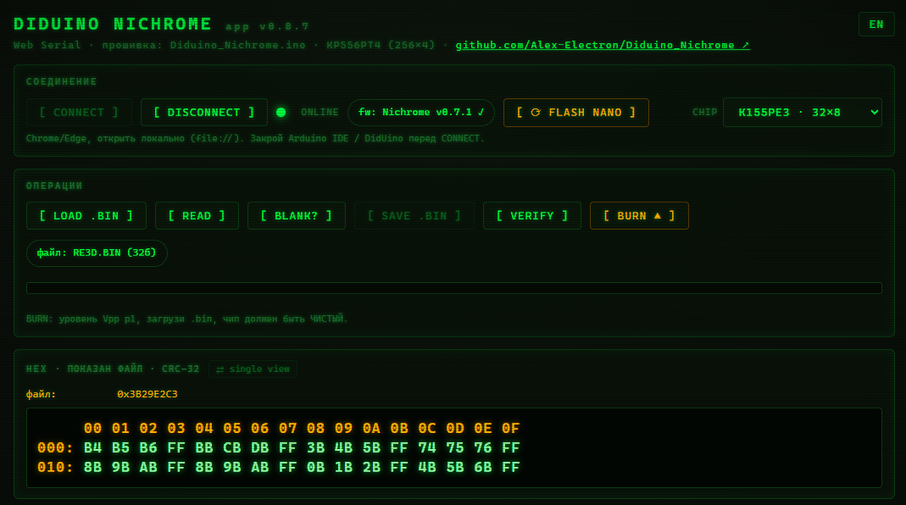
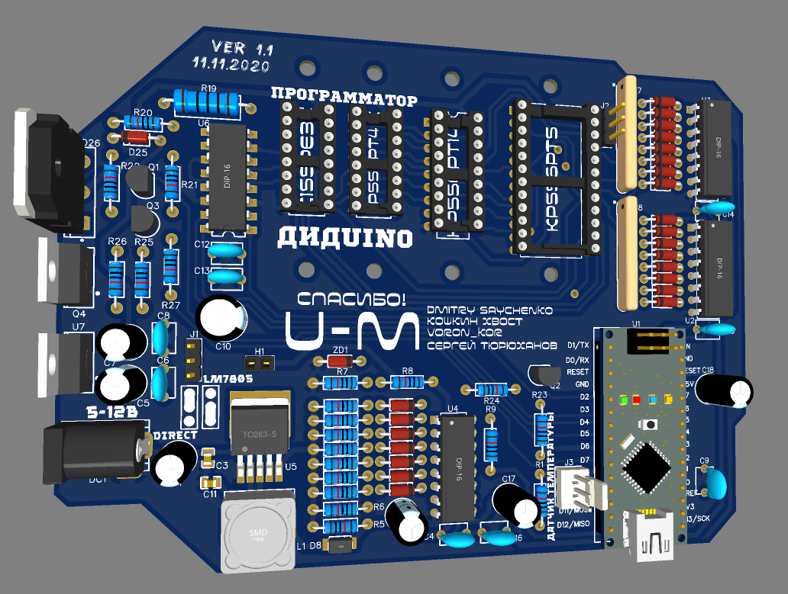

# Diduino Nichrome

**English** · [Русский](./README.ru.md)

Firmware and a browser-based programmer for the Soviet bipolar fuse-PROM **КР556РТ4** (256×4 bit, one-time programmable).

This is a continuation of the open **Diduino** project. The hardware is unchanged; what is new here is a rewritten host application that runs in the browser and a burn routine built to not destroy a chip when something goes slightly wrong.




**▶ Open the programmer:** <https://alex-electron.github.io/Diduino_Nichrome/diduino_nichrome.html> — runs in Chrome or Edge, nothing to install. (GitHub Pages serves it over HTTPS, which is what Web Serial needs.)

<p align="center">
  <a href="https://alex-electron.github.io/Diduino_Nichrome/diduino_nichrome.html"></a>
</p>

---

## Credits — the original project

The board, the schematic and the boost-converter design are **not mine**. They come from the open **Diduino** programmer, and all the hardware credit goes to its authors.



**Original project — main repository: <https://github.com/Radionews/diduino>**

- **Andrew Naumenko (naym1993)** — Diduino author, schematic and PCB.
  EasyEDA: <https://oshwlab.com/naym1993/prog_did>
- **walhi** — the base Arduino programmer this grew from.
  <https://github.com/walhi/arduino_eprom27_programmer>
- **ProgRT** thread on the ZX-PK forum — where the whole idea started.
  <https://zx-pk.ru/threads/15617-programmator-ppzu-155re3-556rt4-i-drugikh.html>

This repository adds only the new firmware and the web app. The license stays the same as the original: **BSD-2-Clause**.

---

## Why I rebuilt the software

The stock Diduino works. Three things made me redo the host side and the firmware anyway:

1. **A web page you just open.** No Qt application to download, install or keep up to date. One self-contained HTML file, opened straight from disk in Chrome or Edge, talks to the board over Web Serial.

2. **A tighter, more reliable firmware.** The original sketch is a single read/write engine. I wanted the burn step itself to be defensive: check the chip before touching it, refuse a corrupted transfer, set the programming voltage on its own instead of trusting me to remember, and always leave the board in a safe state afterwards. КР556РТ4 is one-time programmable — a single wrong move ruins the part, so the firmware should catch the obvious mistakes instead of faithfully executing them.

3. **Soak pulses.** A fuse link that just barely opened can read back as programmed and then "regrow" later. After a bit takes, the firmware now drives a few extra pulses into it (the datasheet allows 40–100) so the link is fully blown, not marginal. This came out of digging through the programming spec and is the main new idea on the burn side.

---

## Repository layout

```
Diduino_Nichrome/
├── README.md                # this file (English)
├── README.ru.md             # Russian
├── LICENSE
├── firmware/
│   ├── Diduino_Nichrome/
│   │   └── Diduino_Nichrome.ino   # Arduino sketch (the folder name must match the .ino)
│   └── build-hex.ps1              # compiles both MCUs and embeds the firmware into the page below
└── docs/
    └── diduino_nichrome.html      # the browser programmer + embedded firmware (GitHub Pages, HTTPS)
```

---

## The chip: КР556РТ4

A Soviet bipolar PROM with nichrome fuse links, 256 words of 4 bits, an analog of the 82S129.

- The fuses are **one-way**: a bit can go 0 → 1, never back. A blank chip reads all zeros.
- Programming needs an elevated voltage (~12.5 V) on a data pin while Vcc stays at 5 V.
- Because it is one-time, you get exactly one attempt per chip. The point of this project is to make that one attempt count.

---

## Quick start

1. **Open the app.** Open the [hosted programmer](https://alex-electron.github.io/Diduino_Nichrome/diduino_nichrome.html) in Chrome or Edge (or `docs/diduino_nichrome.html` locally). Click CONNECT and pick the board's COM port.
2. **Firmware.** If the board isn't running Diduino_Nichrome (or it's too old), the operations stay locked and the app offers **[ ⟳ FLASH NANO ]** — it flashes the firmware straight from the browser over Web Serial (no Arduino IDE), reading the chip signature and picking the build that matches it (ATmega328P or ATmega168). You can instead upload `firmware/Diduino_Nichrome/Diduino_Nichrome.ino` from the Arduino IDE yourself. The header then confirms the firmware version, and the current Vpp is read automatically.
3. **Read or burn.**
   - `READ` pulls all 256 nibbles and shows them as hex, with a CRC-32.
   - `LOAD` opens a `.bin`; the same hex view and CRC appear for the file.
   - `BURN` programs the chip. It only goes ahead if the chip is compatible and the transfer checksum matches, then it verifies every cell on the board.

The interface is in Russian by default; the button in the top-right switches to English.

---

## The burn, step by step ("Nichrome")

The burn is gated so that the usual ways to wreck a chip are caught before any voltage reaches a fuse:

| Stage | What it does |
|-------|--------------|
| **Transfer + CRC-32** | The host streams 256 bytes; the board computes a CRC-32 and the host must send back its own expected CRC. If they differ, the burn is refused. A corrupted or wrong file cannot get through. |
| **Compatibility check** | The chip is read first. If any cell already holds a 1 where the image needs a 0 (impossible to undo on a fuse PROM), the burn aborts and lists the conflicts. A blank chip, or a re-burn of the same image onto a partly-programmed chip, passes. |
| **Voltage check** | The board sets the program level (p1, ~12.5 V) itself and measures it. It will not pulse a fuse at the wrong voltage just because the level was left wrong. |
| **Per-bit verify** | Each bit is pulsed and read back; pulsing stops as soon as the bit takes. |
| **Soak** | A few extra pulses after the bit takes, so the link is fully blown. |
| **Verify at rest** | The boost drops to its floor and the whole chip is re-read and compared to the image. |
| **Safe state** | On every exit (success, abort or error) the board ends with no program pulse, the boost dropped to its floor, and the serial buffer flushed. |

---

## Serial protocol (115200 8N1, commands end with Enter)

| Command | Meaning |
|---------|---------|
| `?` | help |
| `v` | read the programming voltage (Vpp) |
| `p<n>` | set boost level 0–7 (p1 ≈ 12.5 V for РТ4) |
| `I<n>` | max pulses per bit (default 1000) |
| `L<n>` | pulse width in µs (default 40) |
| `D<n>` | duty %, sets the pause between pulses (default 10) |
| `S<n>` | soak pulses after a bit takes (default 50, capped at 128) |
| `R` | read the whole chip, 256 raw bytes |
| `B` | burn: stream 256 bytes, then the CRC gate, checks and verify |
| `s` | safe state |

There is also a diagnostic set for board bring-up (`a c m d e k W`) used to test the address chain, mux, CS line and a single program pulse.

---

## Programming defaults

| Parameter | Command | Default | Notes |
|-----------|---------|---------|-------|
| Vpp level | `p` | p1 (~12.5 V) | the burn forces this itself |
| pulses / bit | `I` | 1000 | upper limit; stops early when the bit takes |
| pulse width | `L` | 40 µs | |
| duty | `D` | 10 % | pause = width × 100 / duty |
| soak | `S` | 50 | datasheet window is 40–100 |

---

## Voltage calibration

**Why this exists.** The board reads Vpp through a divider on A4. The firmware does **not** assume a fixed supply voltage — it measures Vpp *ratiometrically* against the chip's internal 1.1 V band-gap reference, so the reading is correct **whatever powers the board** (a bench supply, the on-board 7805, or just the Nano's USB 5 V) and stays correct even if the rail sags under load. That removes the old "it reads right on my 5 V but wrong on yours" problem.

The one thing the firmware can't know on its own is the *exact* value of that internal reference — it's nominally 1.1 V but varies about **±10 %** from chip to chip. Out of the box the reading is therefore already supply-independent but only ~±10 % accurate in absolute terms. A **one-time calibration** pins it down exactly, and the result is stored in the Nano's EEPROM, so you do it once and it survives reboots and any later change of power source.

**When to bother.** If a rough Vpp is fine for you, skip it — the readings already track reality. If you want the displayed Vpp to match your multimeter to two digits, calibrate once.

**How to calibrate (one time, ~30 s):**

1. Flash firmware **v0.6.0 or newer** (the app does this — see Quick start) and **CONNECT**.
2. Set any Vpp level — e.g. pick **p1** in the dropdown and press **SEND SETTINGS**. (The level doesn't matter: the calibration constant is the same at every level. Just don't put a chip in the socket while raising the voltage.)
3. Put your multimeter on the Vpp test point and read the **actual** voltage **now**.
4. Press **`[ CAL V ]`**. The dialog shows what the board currently thinks Vpp is and asks for the real value — type the number your multimeter shows **at this moment** (e.g. `12.50`) and confirm.
5. Done. The app stores the constant, re-reads Vpp, and verifies it now matches. The value lives in EEPROM forever (until you re-calibrate).

**Notes.**
- You must enter the voltage **measured right now**, not an expected/remembered one — the firmware compares your number against what it reads at this instant. (The dialog shows the live reading to keep you honest.)
- It's level-independent, so calibrating at p1 makes every level (p0…p7) correct.
- Serial command (Arduino IDE / any terminal): `T<centivolts>` — e.g. `T1250` for 12.50 V; `T0` resets to default; `T` alone prints the current constant.
- If the app warns the post-calibration reading is far off (e.g. ~100× the value you typed), the board firmware and the app don't match — re-flash the Nano with **FLASH NANO** and try again.

---

## Safety notes

КР556РТ4 is one-time programmable. Read these once:

- A burn is **irreversible**. Double-check the file and the chip first.
- The high voltage only reaches the chip during the actual program pulses (gated by the WRITE line). Setting the level or reading the chip does not put it on the socket.
- For your one good chip, do a dry run on a sacrificial blank first, read it back, and compare the CRC to your source before committing.

---

## Roadmap

- **Over-temperature cutoff (DS18B20).** The original Diduino kept pins for a DS18B20 temperature sensor. With one fitted, the firmware could watch the chip or the power transistor during a burn and stop if it gets too hot. Soak pulses in particular put heat into the link and the driver, so this would pair well with them. The sensor is not on the current board, so this is left for a future revision.

---

## License

BSD 2-Clause. Original copyright by Naumenko Andrew (2021); the Nichrome firmware and web app are under the same license. See [LICENSE](LICENSE).

## Author

**Alexander Lavrinovich** · <lavrinovich.alex@gmail.com> · [github.com/Alex-Electron](https://github.com/Alex-Electron)
Co-author: AI.

## Contributors

- **[pahan4](https://github.com/pahan4)** (Paul Leikam) — ideas behind the in-app firmware update (flashing the Arduino straight from the browser over Web Serial), embedding the firmware into the single HTML page (offline, self-contained), and the split file ↔ chip verify view.
